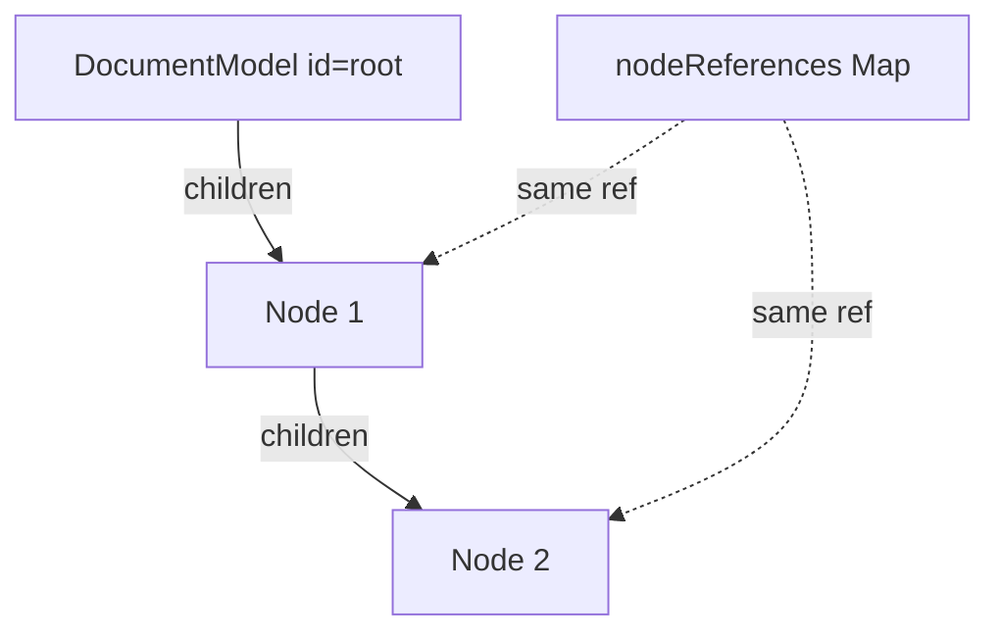

# Document model

## What it is

The document is the **source of truth** for board objects: a tree of nodes plus a flat id index. Package: `@canvas-engine/document` (`DocumentModel` in `packages/document`). UI/renderers will read from this; they do not own the stickies.

## Why it exists

A Mural-like board needs create / nest / select / delete that stay consistent. Separating document data from paint (DOM or canvas) matches the lesson from [Mural’s DOM → canvas migration](https://dev.to/mural/performant-paintings-building-a-canvas-render-engine-4506): presentation can change; structure stays.

## How it works here

**Shape (learner-built):**

- **`DocumentModel` is the root** (`id: 'root'`). No separate root node object.
- **`Node`:** `id`, `x`, `y`, `parentId`, `children: Map<id, Node>`.
- **Tree:** containment via nested `children` Maps (sibling lookup by id is local O(1)).
- **`nodeReferences: Map<id, Node>`:** document-wide O(1) get — stores the **same object references** as the tree (not copies).
- **`activeNode`:** live reference to the current insert/selection cursor (`Document` or `Node`).
- **API today:** `addNode`, `selectNode`, `deleteNode` (single node; see TBD), `getNode` (private, via index).

**Decision trail:** [ADR 001](./decisions/001-document-as-tree.md) chose tree for containment/transforms. Hybrid id map was added once recursive get-by-id hurt — same escape hatch the ADR already listed.

## Alternatives considered

- Pure nested walk for every get — works; painful as the board grows.
- Path codes / merkle-style parent chains — deferred; wrong or heavy for v1.
- Flat array of ids for existence — weaker than `Map`/`Set`.
- See ADR 001 for tree vs flat-canonical vs graph.

## What I would do differently

- Avoid `{...node}` when indexing (almost shipped two objects; `toEqual` hid it — use `toBe` for identity).
- TBD: clearer story for Document-as-root vs a dedicated root `Node` if types get noisy.

## Open questions / TBD

- [ ] `deleteNode` should remove **descendants** from `nodeReferences` (and tree), not only the selected node
- [ ] JSON **save/load** (`Map` does not `JSON.stringify` cleanly — need a serializable shape)
- [ ] Stable id generation (not only caller-provided ids)
- [ ] Update/move/reparent APIs
- [ ] Whether `activeNode` must equal `parentId` target on every add (current rule) vs looser insert rules
- [ ] Scene graph: local `x,y` → world coordinates (roadmap #2)

## Trade-offs

| Choice | Gain | Cost |
|--------|------|------|
| Tree `children` | Containment / subtree reasoning | Structure + index must stay in sync |
| Flat `nodeReferences` | O(1) get by id; no recursion for lookup | Extra write on add/delete |
| Same object in both | One source of truth in memory | Easy to break with clones/spreads |
| Document-as-root | Empty board is just the document | `Node \| Document` union for cursor |
| Class for actions | Clear home for operations | Not a perf win/loss at this scale |

## How Mural probably solves this

Hierarchical composition for frames/groups; strong identity for selection/sync (indexed access); canvas paint at scale; associations (connectors) beyond pure parent/child.

## References

- [ADR 001: document as tree](./decisions/001-document-as-tree.md)
- [Performant Paintings (Mural)](https://dev.to/mural/performant-paintings-building-a-canvas-render-engine-4506)
- `packages/document`
- Engineering notes: [tree for transforms](./engineering-notes/2026-07-20-document-tree-for-transforms.md), [co-implement](./engineering-notes/2026-07-20-co-implement-not-solo-ship.md), [aha not recipes](./engineering-notes/2026-07-20-guide-to-aha-not-recipes.md), [session close](./engineering-notes/2026-07-20-document-session-close.md)
