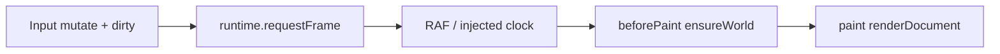

# Runtime (frame loop)

## What it is

Display-tied **frame clock** for the engine. Package: `@canvas-engine/runtime`. Hosts call `requestFrame()` after mutations; the loop coalesces to **at most one tick per animation frame** and dispatches ordered phases (`beforePaint` → `paint`).

## Why it exists

Dirty world sync only helps when paint rate is lower than input rate. That mismatch must live in the **engine**, not the demo. A dedicated runtime owns the clock so document / renderer / hit-testing stay sync and reusable (tests inject a fake scheduler).

## How it works here

- **`createFrameLoop({ scheduleFrame?, cancelFrame? })`** — defaults to `requestAnimationFrame` / `cancelAnimationFrame` (no hardcoded 60fps).
- **`requestFrame()`** — idempotent until the tick runs; every call increments `requestCount` (coalesced no-ops still count).
- **`onBeforePaint` / `onPaint`** — ordered listeners (demo: commit pending input + `ensureWorld`, then `renderDocument`).
- **`cancelPending` / `stop`** — drop a scheduled tick; `stop` also clears listeners.
- **`tickCount` / `requestCount`** — ticks run vs times `requestFrame` was asked.

Hosts should **sample input at event rate** and **apply document mutations in `beforePaint`** (or equivalent). Mutating + painting on every `pointermove` often yields moves ≈ paints on tightly synced setups (e.g. macOS Chrome) — that does **not** mean dirty/runtime are useless; see [cross-browser pointer note](./engineering-notes/2026-07-22-dirty-cross-browser-pointer.md).

- **`setMaxFps(30 | null)`** — optional reduced-motion cap. Still RAF-driven: early frames reschedule until ~33ms elapsed. `null` = every display frame (default).
- Demo checkbox mirrors this; initializes from `prefers-reduced-motion: reduce`.

Hit-testing still calls `ensureWorld` **immediately** on pick so selection is not a frame late.

## Alternatives considered

- RAF only in the demo — wrong owner ([note](./engineering-notes/2026-07-22-raf-makes-dirty-visible.md)).
- RAF inside renderer — couples clock to canvas.
- Hardcoded `fps: 60` — fights high-refresh displays.

## What I would do differently

- Later: optional fixed timestep / command queue if undo or collab needs discrete steps.

## Open questions

- [ ] Should document auto-register `ensureWorld` when creating a loop with a doc handle?
- [ ] Multi-view: one loop per board vs shared clock?

## Trade-offs

| Choice | Gain | Cost |
|--------|------|------|
| Separate runtime package | One clock; testable; packages stay pure | Host must wire listeners |
| RAF as tick source | Matches display | Not a literal “60” constant |
| beforePaint then paint | Derived sync before draw | Host must register order |

## How Mural probably solves this

A central render / frame scheduler that batches invalidation from input and collaboration into paint frames; spatial and world derived state refresh on that cadence.

## References

- [ADR 015](./decisions/015-runtime-frame-loop.md)
- [ADR 014](./decisions/014-dirty-root-ensure-world.md)
- [goal.md](./goal.md)
